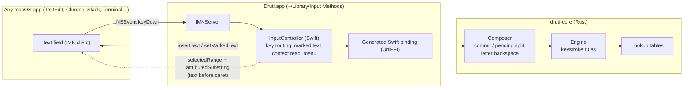

# Druti for macOS: tech stack and design

Status: implemented. This was the original design interview write-up. The specs, the design as
built and the task list live in the archived OpenSpec change
[`openspec/changes/archive/2026-09-28-add-macos-input-source/`](../openspec/changes/archive/2026-09-28-add-macos-input-source/) (specs now in
[`openspec/specs/`](../openspec/specs/)), and build
and install steps are in [`macos/README.md`](../macos/README.md). Where this page and the change
disagree, the change is correct.

Since then the TypeScript engine has been removed (OpenSpec change `druti-wasm-playground`). Rust is
the only engine, the crates are named `druti-core` and `druti-ffi`, the fixtures are frozen golden
data in `crates/druti-core/tests/fixtures/`, and the web playground runs the same engine through
`druti-wasm`. The sections below are updated to match; the milestones are kept as history.

## Decisions

| Topic | Decision |
|---|---|
| Audience | Personal use. Built and installed locally, ad-hoc signed. No paid Apple Developer account, no notarization. |
| Engine | Port the algorithm to a **Rust core**. At first TypeScript stayed the reference and shared fixtures enforced parity; now Rust is the only engine, also used on the web through WASM. |
| Platforms | macOS now. The binding layer must also serve an **iOS keyboard extension** later. |
| Typing UX | Exact Bengali on every keystroke. The Bengali word being typed is held as marked text, underline hidden where the app allows; it is committed at the next word break (space, punctuation, digit, Return, caret move). Committed text is never changed afterwards, so no app needs to support replacement ranges. |
| Backspace | In the pending word: delete one **letter** (a consonant with the hasant joining it, or one kar or sign), decided by the Rust composer; the next consonant starts a new letter. Nothing pending: pass the key to the app. |
| Bangla ↔ English | The macOS input source switch (Globe key / Ctrl+Space). The engine's English mode is not used. |
| Kar attach after caret moves | Read the text before the caret from the app when it allows (engine `textBeforeCaret`); otherwise fall back to the independent vowel. |
| Repo | This repository, as a monorepo. |
| v1 scope | Typing + input menu, menu toggles (digits, dari, smart quotes), `make install`/`make uninstall`, "Convert selection" (bulk roman→Bengali). |
| Target Mac | Apple Silicon (arm64), latest macOS. Deployment target macOS 14. |

## Tech stack

| Layer | Choice | Why |
|---|---|---|
| Engine core | **Rust** (stable, edition 2021), crate `druti-core`, no `unsafe`, no I/O | Single engine for macOS, the web (WASM) and later iOS. Pure string state machine. |
| Grapheme segmentation | `unicode-segmentation` crate | Finds the last grapheme cluster when Backspace deletes text that isn't Bengali (an emoji, Latin). |
| FFI | **UniFFI** (proc-macro mode), crate `druti-ffi` (library name `bengali_ime_ffi`) | Generates an idiomatic Swift API (strings, structs, enums) with no hand-written C. The same generated binding works in an iOS keyboard extension. |
| Native packaging | Static lib for `aarch64-apple-darwin` packaged as an **XCFramework** (`scripts/build-xcframework.sh`) | Xcode links it like any framework; iOS slices (`aarch64-apple-ios`, `aarch64-apple-ios-sim`) are added to the same XCFramework later. |
| Input method | **Swift 6 + AppKit + InputMethodKit** (`IMKServer`, `IMKInputController`) | The only supported API for a third-party input source on macOS. No SwiftUI needed. |
| Xcode project | **XcodeGen** (`macos/project.yml`) | The project is a small reviewable YAML file instead of a merge-hostile `.pbxproj`. |
| Build / install | `Makefile` + `xcodebuild` + `codesign -s -` (ad-hoc) | `make install` builds everything, signs, copies to `~/Library/Input Methods`, and restarts the input method. |
| Settings | `UserDefaults` in the input method's own domain | Backs the menu toggles. |
| Logging | `os.Logger` (subsystem = bundle id) | Read with `log stream --predicate 'subsystem == "…"'`. |
| Behaviour tests | Golden JSON fixtures (first generated by the TS engine, now frozen), replayed by `cargo test`, including seeded random key sequences | Pins every keystroke's result; intended changes edit the fixtures in the same commit. |
| CI | A Rust job and a WASM/playground job on `ubuntu-latest`; a `macos-15` job that builds the XCFramework and the `.app` | Rust and fixtures run on Linux; only the Apple build needs a Mac runner. |

## Architecture



### Repository layout

```
druti-ime/
├── Cargo.toml                  # workspace
├── crates/
│   ├── druti-core/             # engine, data tables, composer, transpile
│   │   └── tests/fixtures/     # golden: engine/*.json (key → actions, output, buffer), composer/*.json
│   ├── druti-ffi/              # #[uniffi::export] surface only (Swift)
│   └── druti-wasm/             # #[wasm_bindgen] surface only (web playground)
├── scripts/build-xcframework.sh
├── examples/playground/        # Vite + TypeScript UI on druti-wasm, deployed to GitHub Pages
├── macos/
│   ├── project.yml             # XcodeGen
│   ├── BengaliIMECore/         # Swift package: generated bindings + key routing/context helpers, XCTest
│   ├── Druti/                  # main.swift, InputController.swift, ClientText.swift, Settings.swift, Info.plist
│   ├── Tools/make-icon.swift   # renders the menu bar icon at build time
│   └── Makefile
└── docs/macos-input-source.md  # this file
```

## How the algorithm becomes a macOS input source

### 1. The commit / pending split

The engine returns edit actions (`Insert`, `Replace(back)`, `Delete(back)`) that rewrite
text it already emitted: `k` then `h` replaces ক with খ. An input method cannot reliably rewrite
text it has already committed into another app, but it has full control over its **marked text**.

The engine's own state bounds what can change: `buffer` is always a suffix of `output`, and every
rule rewrites only inside `buffer` (aspiration, `kkh` → ক্ষ, `rri` → ঋ/ৃ, a vowel removing the hasant
of an `rr` reph, `Oi`/`OU`, ya-phala, nasal connectors). The composer keeps more than that pending: the whole Bengali word that ends the output
(letters, signs, kars, hasant, nukta, joiners), so Backspace can also edit the word as marked text.
After every key:

```
pending   = the Bengali word ending output (⊇ buffer)  → sent with setMarkedText (still editable)
committed = everything before it                        → sent with insertText (final text in the app)
```

Example, typing `khub `:

| Key | Engine output / buffer | App shows | IMK calls |
|---|---|---|---|
| `k` | ক / ক | ক (pending) | `setMarkedText("ক")` |
| `h` | খ / খ | খ (pending) | `setMarkedText("খ")` |
| `u` | খু / "" | খু (pending) | `setMarkedText("খু")` |
| `b` | খুব / ব | খুব (pending) | `setMarkedText("খুব")` |
| space | খুব␣ / "" | খুব␣ | `insertText("খুব ")` (replaces marked text) |

Committed text is never changed: `Update` has no way to ask for it. A lone `-` or `।` is held as
pending, so `--` → `—` and `।.` → `..` stay inside marked text. A rule that would rewrite committed
text (a `-` committed before a caret move, then another `-`) applies as if the word started at the
caret. This matters because apps differ in replacement support. Chromium-based apps ignore an empty
`insertText` over a range, and Cursor's EditContext editor ignores a range on marked text. Replacing
their own marked text works in every app.

Marked text is set with attributes that remove the underline. Apps that honour the attributes show
the pending word exactly like normal text; the rest underline the word being typed.

### 2. Rust core API (sketch)

```rust
// The keystroke engine, pinned by the golden fixtures.
pub struct Engine { /* buffer, output, flags */ }
impl Engine {
    pub fn new(config: Config) -> Self;
    pub fn process(&mut self, key: &str, text_before_caret: Option<&str>) -> Vec<Action>;
    pub fn process_backspace(&mut self) -> Vec<Action>;   // deletes the last letter, resumes the cluster (engine only)
    pub fn output(&self) -> &str;
    pub fn buffer(&self) -> &str;
}

// Host adapter for marked-text platforms (macOS, iOS). Exported through UniFFI.
pub struct Composer { /* Engine + committed length */ }
pub struct Update {
    pub commit: String,          // replaces the current marked text as final text
    pub pending: String,         // new marked text ("" = none)
    pub handled: bool,           // false → let the app process the key itself
}
impl Composer {
    pub fn key(&mut self, key: &str, text_before_caret: Option<String>) -> Update;
    pub fn backspace(&mut self) -> Update;   // one letter of the pending word; handled=false if nothing is pending
    pub fn flush(&mut self) -> Update;       // commit pending (focus loss, arrows, shortcuts)
    pub fn reset(&mut self, text_before_caret: Option<&str>) -> Update;   // caret moved: forget engine state
    pub fn matches_text_before_caret(&self, text_before_caret: &str) -> bool;   // late caret report or real move?
}
pub fn transpile_roman_document(input: &str, preserve_line_breaks: bool, config: Config) -> String;

pub struct Config {
    pub bengali_digits: bool, pub dari_for_period: bool, pub smart_quotes: bool, pub autocorrect: bool,
}
```

`Config::default()` turns the output toggles on and Autocorrect off. The engine ignores
`autocorrect`: the composer and bulk conversion apply it (autocorrect change). The engine fixtures
run with the default config.

All lengths crossing the FFI are counted in **UTF-16 code units** (what `NSString`/`NSRange` and JavaScript
strings use), even though Rust stores UTF-8.

### 3. Key routing in `InputController.handle(_:client:)`

| Event | Behaviour |
|---|---|
| Printable key, no ⌘/⌃/⌥ | `composer.key(event.characters, context)`, apply `Update`, return `true` |
| Space | Same as above (engine word boundary); pending is committed together with the space |
| Enter / Return | `flush()`, then return `false` so the app does its own newline or "send". The engine's `splitBlock` is not used. |
| Backspace | `composer.backspace()`, apply `Update`, return `true`. If `handled == false` (nothing pending), return `false` so the app deletes committed text its own way |
| Arrows, Tab, Esc, Home/End, Page keys | `flush()`, return `false` |
| Any ⌘ / ⌃ / ⌥ combination | `flush()`, return `false` (shortcuts keep working) |
| `deactivateServer`, `commitComposition` | `flush()` |
| Password / secure fields | macOS bypasses input methods automatically; nothing to do |

### 4. Reading `textBeforeCaret`

When `pending` is empty and a key could depend on the document (a vowel, which becomes a kar or an
independent vowel; `"` / `'` smart quotes; `-`; `.`), the controller reads the text before the caret.
The Rust `key_reads_document(key)` decides which keys qualify. Consonants don't read it: after a
caret move a consonant always starts a new letter. The composer keeps the text as its view of the
document, so later keys in the same word agree with it:

```
range = client.selectedRange()
text  = client.attributedSubstring(from: NSRange(location: max(0, range.location - N), length: …))
```

`N` is 1,024 UTF-16 units, and the text is clipped at the paragraph start. The kar decision needs only
the last character; smart quotes count opening vs closing quotes in the prior text, so they need the
wider window. If the client returns `nil` (Terminal, many Electron and Java apps), `text_before_caret`
is `None`, and the engine uses its own output: the text it produced since the composer's last reset.
The composer resets on every caret move, focus change and Return, so after a click in such an app a
vowel is independent (`কই`, not `কি`). That is the documented degraded behaviour (design D5).

**Caret-move detection:** before each key the controller compares `selectedRange()` with where it
expects the caret. On a mismatch it reads the text before the caret and asks
`matches_text_before_caret`. Some apps report the caret late or only for a small window around it
(Cursor reports caret 1 with text `প` after `po`), so a text that still ends like what Druti typed
is not a move. Otherwise (click, paste, edits by the app) it calls `reset()`, so the engine never
builds on text that isn't there: click after the `ত` of `করত` and type `h` to get `করতহ`. Arrow
keys, Return and shortcuts commit and reset directly.

### 5. Menu (`InputController.menu()`)

- Bengali digits (on) — `1` → ১
- `.` types দাঁড়ি (on) — `.` → ।
- Smart quotes (on)
- Autocorrect (off) — corrects a finished word from the Autocorrect list; Backspace undoes it
- Convert selection to Bengali — reads the selected text, runs `transpile_roman_document`, and
  replaces it with `insertText(_:replacementRange:)`. Works in apps that expose their text (Cocoa,
  most browsers); disabled or no-op elsewhere.

### 6. Bundle and install (personal use)

- Bundle id: `com.ahamed.inputmethod.Druti` (the id must contain `.inputmethod.`).
- `Info.plist`: `InputMethodConnectionName`, `InputMethodServerControllerClass`
  (`DrutiInputController`, the Objective-C name of the Swift class),
  `LSBackgroundOnly = YES`, `tsInputMethodCharacterRepertoireKey = [Beng]`,
  `tsInputMethodIconFileKey`, and no input modes.
- `make install`: build the XCFramework → `xcodegen` → `xcodebuild` → `codesign --force -s -` →
  copy to `~/Library/Input Methods/` → register with `TISRegisterInputSource` →
  `killall Druti` (macOS relaunches it on demand).
- First time only: System Settings → Keyboard → Text Input → Input Sources → Edit → **+** → Bengali
  → *Druti*. A log-out/log-in may be needed before it appears.
- Keep **ABC** enabled as a second input source: if the input method crashes during development,
  you can still type.

## Fixtures

1. `crates/druti-core/tests/fixtures/engine/*.json` hold (a) the unit cases per rule, (b) a curated
   Bengali word list and (c) seeded random key sequences. For each key they record the actions,
   `output` and `buffer`. They were generated once from the original TypeScript engine and are now
   frozen.
2. `cargo test` replays every fixture through the Rust `Engine` and requires identical actions and
   state after every key.
3. An intended behaviour change edits the affected fixture entries in the same commit, so the
   review shows both. Anything else that breaks a fixture is a regression.
4. Composer-only behaviour (commit/pending split, letter backspace, `-` holding, config toggles)
   has its own hand-written fixtures in `tests/fixtures/composer/`.
5. `crates/druti-core/tests/hosts.rs` types scripts and the random sequences into models of the
   playground, a Mac app and a terminal, and requires the same text in each.

**Letter boundaries.** Backspace deletes one letter (`crates/druti-core/src/letters.rs`): a consonant
with its nukta and joining hasant, one other Bengali code point, or one grapheme cluster of other text.
The engine and composer fixtures pin it.

## Milestones

| # | Milestone | Where it can be built |
|---|---|---|
| M0 | Fixture generator + committed fixtures from the TS engine | Linux (this cloud session) |
| M1 | `druti-core` (then `bengali-ime-core`) Engine port passing all engine fixtures | Linux |
| M2 | `Composer` + `Config` + grapheme backspace + `transpile_roman_document`, with composer fixtures | Linux |
| M3 | `druti-ffi` (then `bengali-ime-ffi`, UniFFI) + XCFramework script | Mac (Swift bindings can be generated on Linux; the Apple build needs a Mac) |
| M4 | IMK app MVP + `make install`: typing works in TextEdit | Mac |
| M5 | Context reading, caret-move reset, `--`, compatibility pass: TextEdit, Notes, Pages, Safari, Chrome, VS Code, Slack, Terminal, iTerm2, Spotlight, Word | Mac |
| M6 | Menu toggles + Convert selection | Mac |
| Later | iOS keyboard extension on the same XCFramework; optional live-commit mode for apps that support replacement ranges | Mac |

## Defaults chosen (not asked; easy to change)

- Input source name **Druti**, bundle id `com.ahamed.inputmethod.Druti`.
- Keys are read from `event.characters`, which assumes a US QWERTY base layout, the same as the web playground.
- Esc commits the pending word (it doesn't cancel it), because what you see is already the final text.
- UniFFI instead of a hand-written C ABI (cbindgen). Revisit if a Windows or Linux input method is
  ever added, since those need a C ABI.
